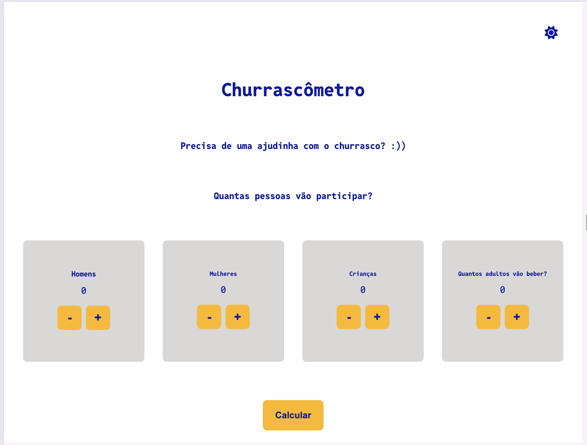
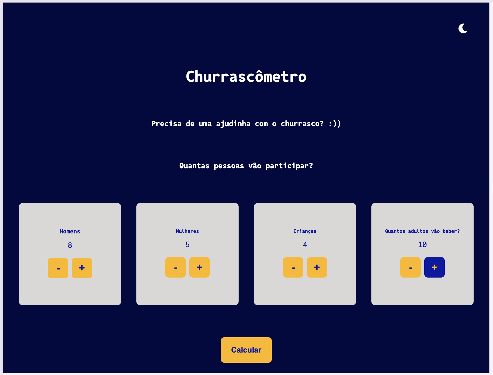
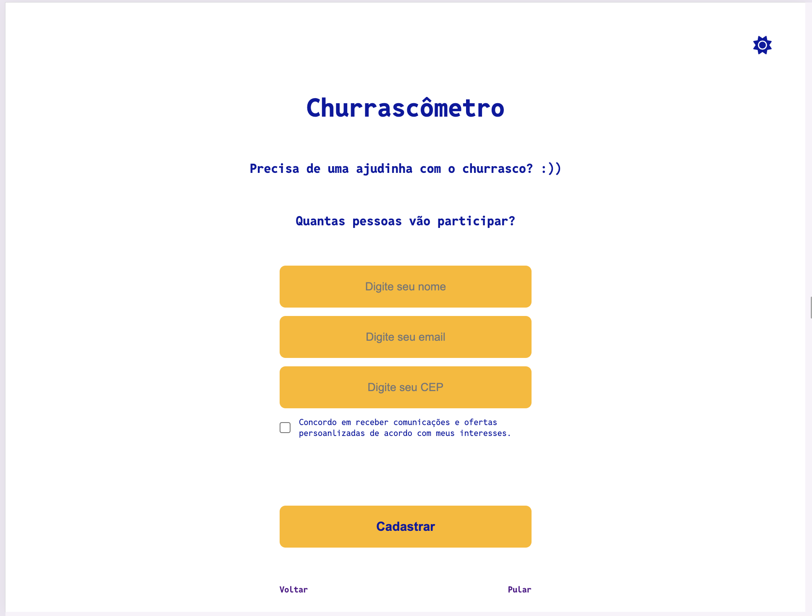
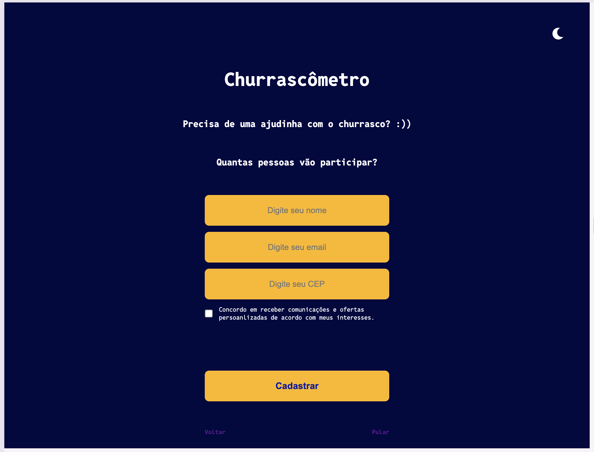
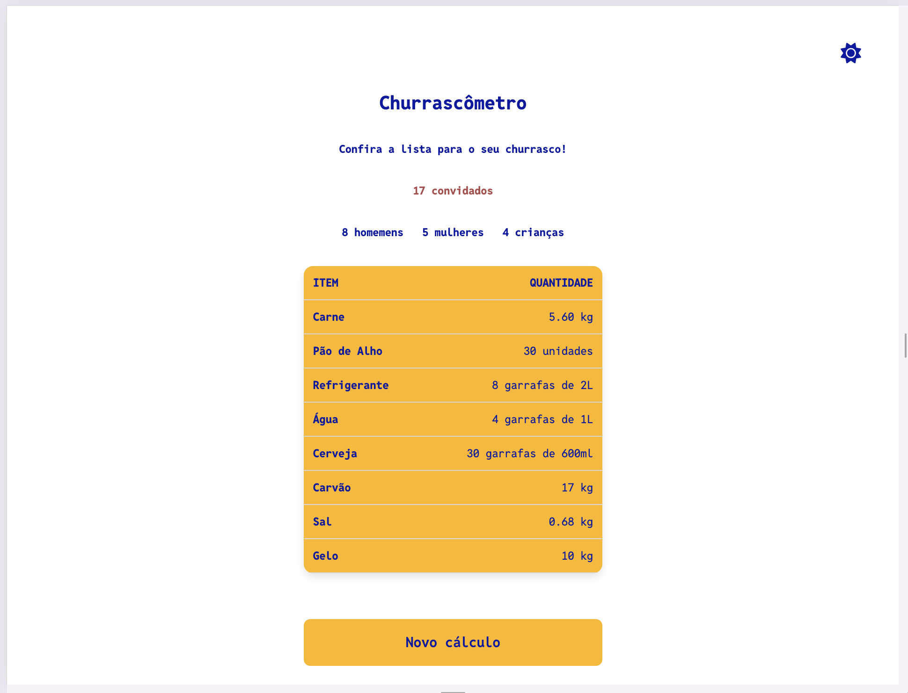
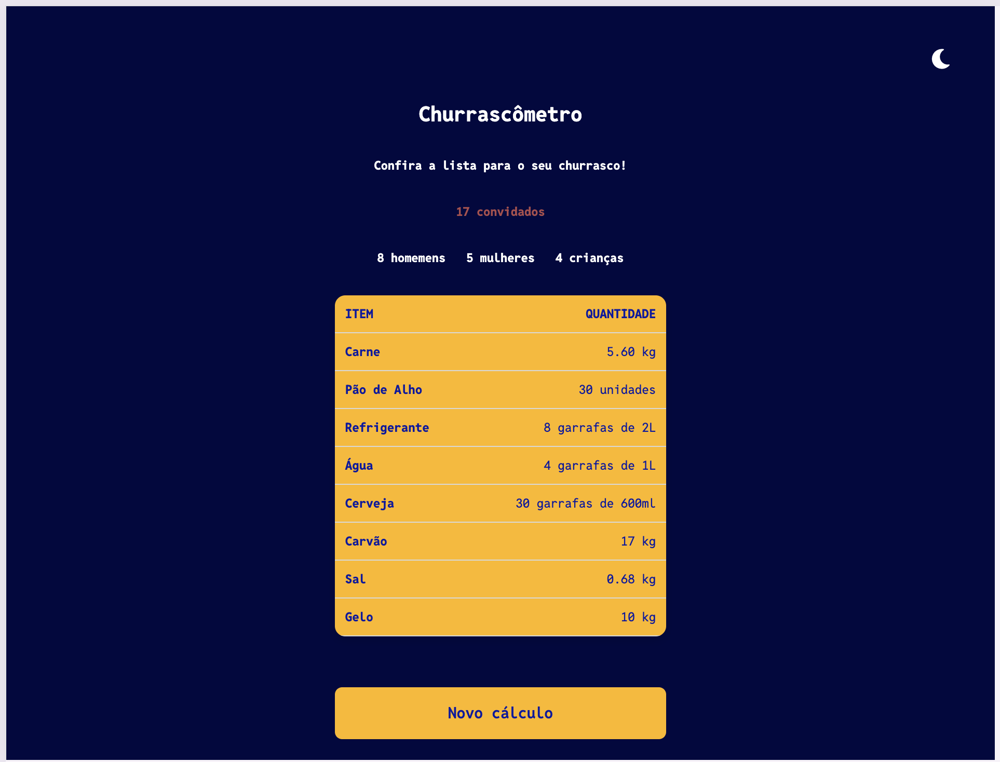

Churrascômetro

Objetivo

Esta é uma calculadora chamada "Churrascômetro" que tem o intuito de calcular os itens para um delicioso churrasco. A página funciona em 3 passos, sendo que cada passo pode ser uma tela montada dinamicamente dentro do mesmo arquivo HTML ou simplesmente os componentes sendo atualizados dinamicamente.

Requisitos

1. A página home contém 4 campos que indicam a quantidade de pessoas entre (homens, mulheres, crianças e pessoas que bebem bebidas alcoólicas).

- Os campos permitem somente inteiros não negativos;

2. A página de cadastro de leads exibe 4 campos para digitar "nome, e-mail e CEP além de checkbox de consentimento com o texto "aceito receber e-mails com promoções".

- Os campos "nome", "e-mail" e CEP são obrigatórios;
- O campo "e-mail" contém um e-mail válido;
- O checkbox é obrigatório;
- Campos inválidos possuem indicação visual na tela;
- Uma vez que o usuário já tenha preenchido os campos, estes não são solicitá-los novamente após a página ser recarregada.

3. A página de resultados exibe uma tabela com o resultado do cálculo com a quantidade indicada para cada um dos itens. Os itens são: carne, cerveja, sal grosso, refrigerante, água, carvão, gelo e pão de alho.

- Tabela de referência:
- Carne
  - 0,4 KG por homem;
  - 0,32 KG por mulher;
  - 0,20 KG por criança;
- Pão de alho
  - 2 por adulto;
  - 1 por criança;
- Carvão
  - 1 KG por pessoa;
- Sal
  - 0,04 KG por pessoa;
- Gelo
  - 5KG a cada 10 pessoas;
- Refrigerante
  - 1 garrafa de 2L a cada 5 pessoas;
- Água
  - 1 garrafa de 1L a cada 5 pessoas;
- Cerveja

  - 3 garrafas de 600ml por pessoa (adultos)

  
  

Critérios

1. A calculadora funciona corretamente e atende os requisitos especificados;
2. O código faz uso de seletores e métodos para manipulação do DOM;
3. O código faz uso de eventos ligados aos elementos da página;
4. O código faz uso de armazenamento no browser (Web Storage API);
5. O código faz uso de chamadas assíncronas e seus derivados.

Desenvolvedora:
Dayane Arnaud
Projeto proposto por Murilo Flesch, professor de Javascript dinâmico, durante curso de Angular do Santander Coders 2024 ministrado pela ADA Tech.
